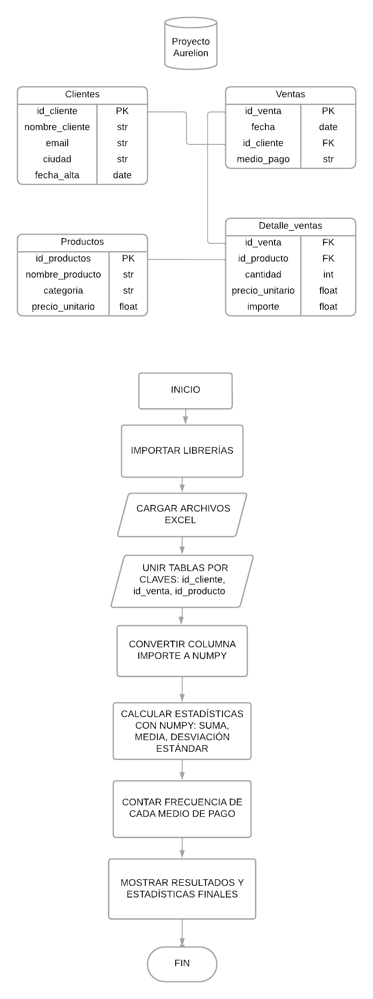

# TEMA: Análisis de los diferentes métodos de pago utilizados en las ventas de la tienda Aurelion
# PROBLEMA: 
La tienda no tiene visibilidad sobre los métodos de pago usados por los clientes.
Actualmente, vende sin medir el comportamiento de pago, lo que impide:
- Identificar qué medios de pago son los más usados.
- Detectar tendencias o patrones de uso según productos o regiones.
- Tomar decisiones informadas sobre qué servicios financieros priorizar.

# SOLUCIÓN:
- Desarrollar un sistema en Python para analizar las ventas y detectar patrones de uso de medios de pago.
El sistema debe:

# DATASET DE REFERENCIA

## FUENTE
Dataset de la tienda Aurelion.
## DEFINICIÓN
Incluye 4 tablas principales distribuidas en 4 archivos distintos de excel (.xlsx): 
- Clientes
- Detalle_ventas
- Productos
- Ventas
## ESTRUCTURA Y TIPO DE DATO
- Clietes: información de los clientes que compran en la tienda.
    - id_cliente (int)
    - nombre_cliente (str)
    - email (str)
    - ciudad (str)
    - fecha_alta (date)
- Detalle_ventas: cantidad y precios de productos vendidos en cada venta.
    - id_venta (int)
    - id_producto (int)
    - nombre_producto (str)
    - cantidad (int)
    - precio_unitario (float)
    - importe (float)
- Productos: artículos que ofrece la tienda según su categoría y precio.
    - id_producto (int)
    - nombre_producto (str)
    - categoria (str)
    - precio_unitario (float)
- Ventas: registra cada transacción del cliente.
    - id_venta (int)
    - fecha (date)
    - id_cliente (int)
    - nombre_cliente (str)
    - email (str)
    - medio_pago (str)
## ESCALA

# INFORMACIÓN
La tienda puede invertir en mejorar los métodos de pago más demandados. Puede replantear la oferta de los productos con baja salida e incentivar ciertos métodos de pago.

- ¿Cuáles son los métodos de pago más utilizados?
- ¿Qué productos son los más comprados según el método de pago?
- ¿De qué lugares provienen los clientes que usan esos métodos de pago?
- ¿Los clientes usan siempre el mismo método de pago?
- ¿Qué días de la semana se usan más y menos los diferentes métodos de pago?
- ¿Qué datos son necesarios para el análisis del problema?
- ¿Necesitamos nuevos campos de datos para realizar un mejor análisis?

# PASOS
1. Leer los datos desde los archivos excel del dataset(Clientes, Ventas, Productos y Detalle_ventas).
2. Procesar y unificar la información para:
    - Detectar los métodos de pago más frecuentes.
    - Identificar los productos más vendidos y menos vendidos por tipo de pago.
    - Determinar los lugares con mayor incidencia de cada método de pago.
    - Analizar variaciones temporales(por días de la semana o fechas específicas).
3. Generar gráficos y reportes para una mejor interpretación.

# PSEUDOCÓDIGO
1. Importar librerías(pandas y numpy)
2. Cargar los datos(los 4 datasets)
3. Unir tablas por claves
    - ventas_detalle ← unir(ventas, detalle, por="id_venta")
    - data ← unir(ventas_detalle, clientes, por="id_cliente")
    - data ← unir(data, productos, por="id_producto")
4. Convertir columna de importes a arreglo NumPy
    - convertir a numpy los datos de la variable importe
5. Calcular estadísticas con NumPy
    - sumar los importes
    - sacar el promedio de los importes
    - sacar la desviación estándar de los importes
6. Calcular frecuencia de métodos de pago
    - contar la frecuencia de los métodos de pago
7. Calcular porcentaje de uso de cada método
    - longitud de los datos
    - calcular el porcentaje de los métodos de pago usando la frecuencia y el total de transacciones
8. Mostrar resultados

# DIAGRAMA DEL PROGRAMA

# SUGERENCIAS Y MEJORAR APLICADAS CON COPILOT